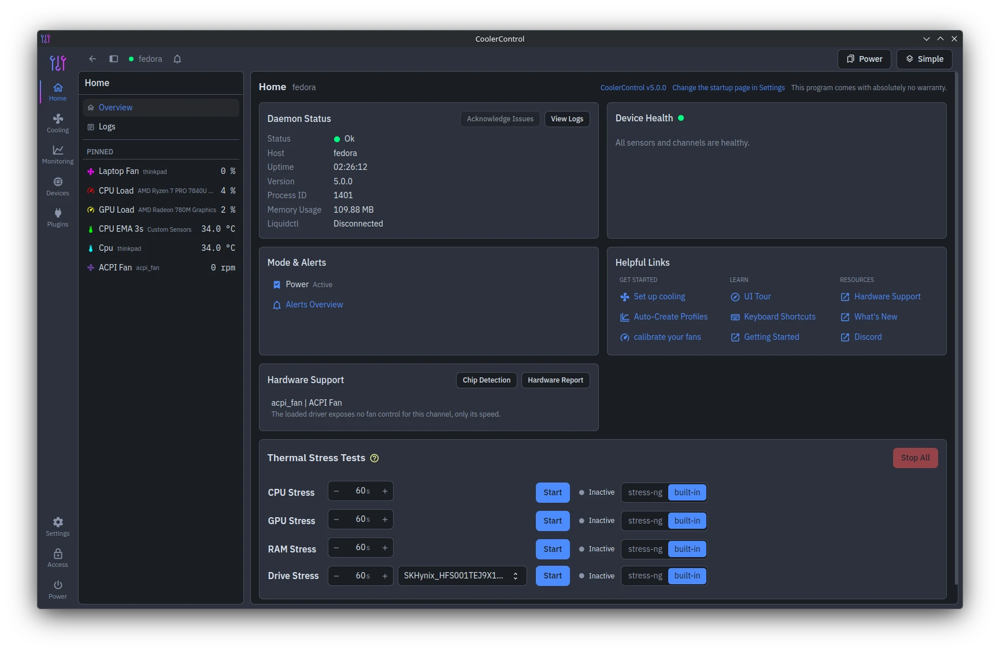
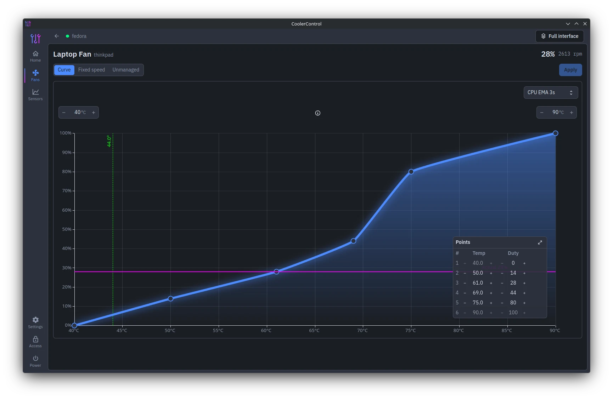
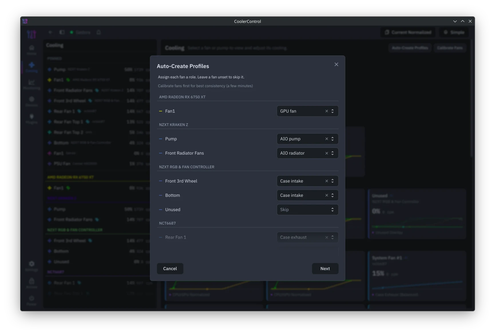
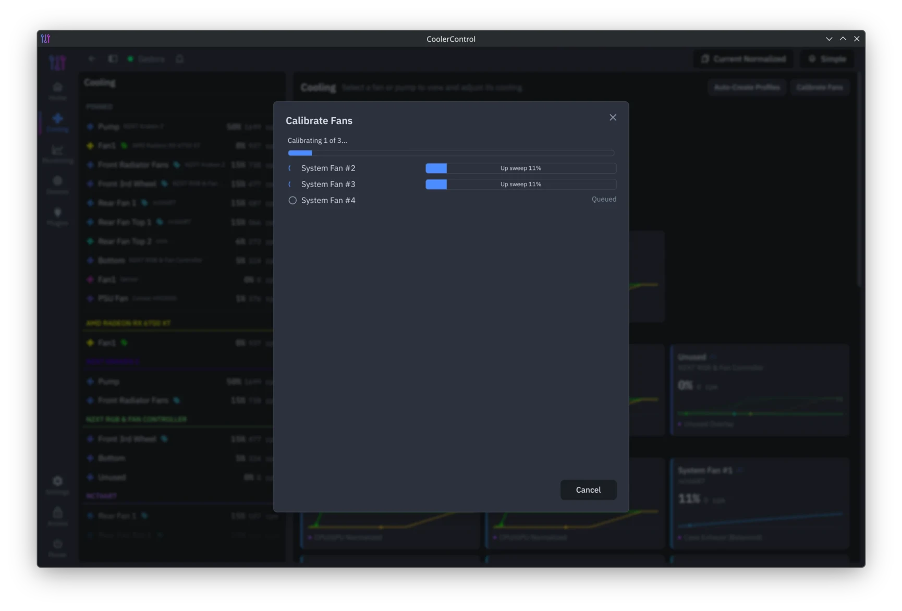
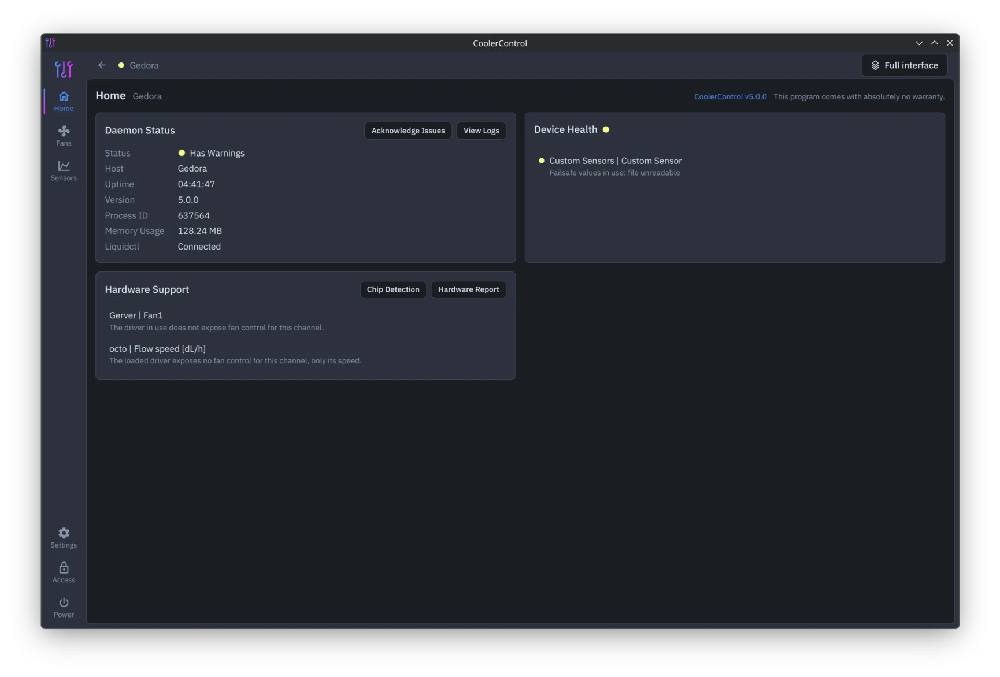
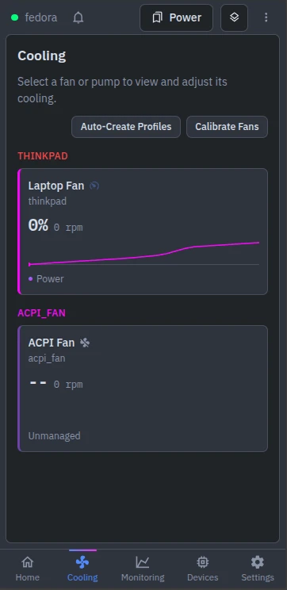
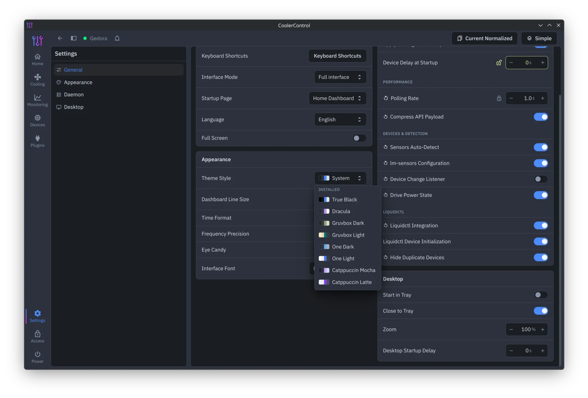
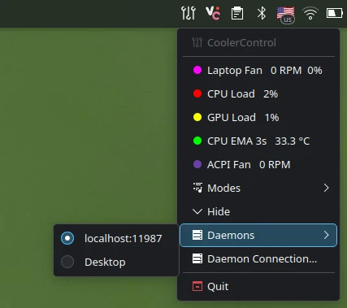
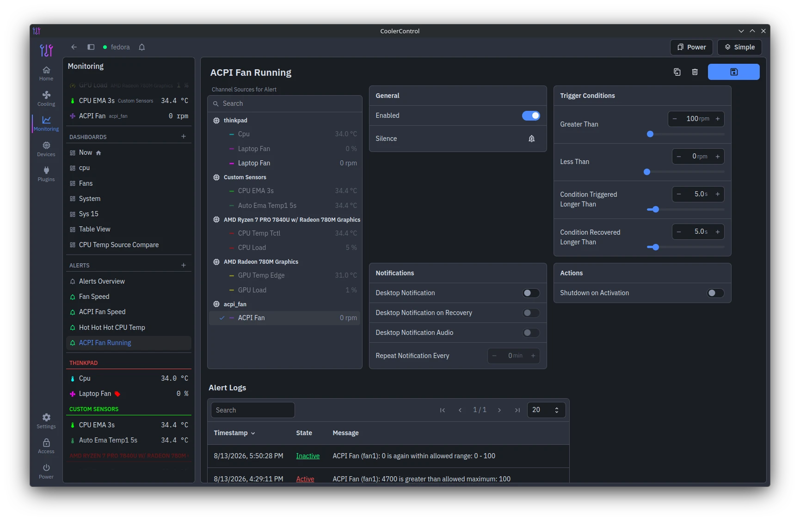

# What's New in CoolerControl 5.0

## The new interface

The application shell was rebuilt around six areas: Home, Cooling, Monitoring, Devices, Plugins and
Settings. A persistent icon rail gets you anywhere in one click, and every area opens with a landing
page.

## Simple mode

New setups now start in a Simple interface: pick a fan, draw a curve, done. The full interface stays
one header toggle away, and switching is lossless in both directions.

## Auto-Create Profiles

A new wizard inspects your hardware and generates a complete cooling setup for CPU coolers, GPU
fans, AIO pumps and radiators, case fans and laptops. Everything it creates is a normal profile you
should tune afterwards.

## Fan calibration

The calibration wizard helps calibrate multiple fans at once, and measures what your fans actually 
do: their true minimum, where they stall, how duty maps to RPM, and a newly calibrated fan can 
convert its profile to use true duty values.

## Device health and hardware insight

A health panel tracks failsafed channels and missing sensors, with badges through the menus. The new
Hardware Support card explains what startup detection found, why a fan cannot be controlled, and
produces a paste-ready hardware report.

## On your phone

The Web UI now has a real mobile layout: bottom navigation, a dashboard switcher, and editors that
reflow to fit. Check temperatures or fix a curve from the couch.

## Themes

Nine color themes ship installed in light and dark variants: True Black, Dracula, Gruvbox, One,
Catppuccin, Tokyo Night, Monokai, Nord and Solarized. Custom themes gained success, warning, error
and info colors, and are shareable with a single theme code.

## The desktop app grows up

The desktop app now manages saved daemon connections with per-connection tokens, switches daemons
from a tray submenu, and pins live sensor readings into the tray menu. Remote connections are
protected by TLS certificate pinning with a first-use trust prompt.

## Alerts that work with you

Alerts can now watch multiple sources at once, be silenced for a set time, and keep a log on each
alert page. A top bar indicator and a tray badge make sure you still notice the ones that matter.

## Under the hood

The daemon now uses io_uring by default, holds sysfs descriptors across ticks, and reads sensors
without heap allocation. Most LCD updates cost a fraction of what they did, the UI and desktop app 
each use a single connection for live updates, log output is bounded and de-duplicated, and the
long-session memory growth in the desktop app is fixed.

...and much more. See the [full changelog](../../CHANGELOG.md) for everything in 5.0.
